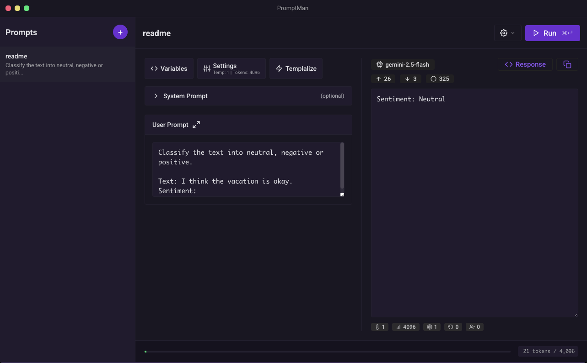

<p align="center">
  
  
  
</p>

<h1 align="center">
  🚀 PromptMan
</h1>

<p align="center">
  <strong>A modern IDE for creating, testing, and managing AI prompts</strong>
</p>

<p align="center">
  PromptMan is a desktop tool built with Electron and React that provides a complete experience for working with artificial intelligence prompts. Ideal for developers, researchers, and AI enthusiasts who need a professional environment to create and test prompts.
</p>

<p align="center">
  
</p>

---

## ✨ Main Features

### 🎯 **Smart Prompt Editor**

- Modern and intuitive interface for prompt creation
- Support for system and user prompts
- Editor with syntax highlighting and automatic formatting
- Auto-save to preserve your work

### 🔧 **Dynamic Variables**

- Variable system with `{{variable_name}}` syntax
- Automatic variable detection in text
- Visual interface to manage variable values
- Dynamic substitution during execution

### 🧪 **Testing and Execution**

- Test your prompts in real-time
- Support for multiple AI providers (OpenAI, Google Gemini, Anthropic Claude)
- Flexible parameter configuration (temperature, max tokens, etc.)
- Execution history and responses

### ⚡ **Advanced Templalization**

- Transform simple prompts into structured templates
- Automatic separation of prompt components
- XML structure generation for reuse
- Customizable templalization settings

### 💾 **Prompt Management**

- Save and organize your favorite prompts
- Categorization and tagging system
- Advanced search and filters
- Export and import prompts

### 🎨 **Modern Interface**

- Elegant and responsive design
- Dark/light theme
- Multi-language support (English/Portuguese)
- Keyboard shortcuts for productivity

### 🔌 **Multi-Provider**

- **OpenAI**: GPT-4o, GPT-4o Mini, GPT-4 Turbo, GPT-3.5 Turbo
- **Google Gemini**: 1.5 Flash, 1.5 Pro, Pro
- **Anthropic Claude**: 3.5 Sonnet, 3 Opus, 3 Sonnet, 3 Haiku
- Easy API key configuration
- Automatic switching between providers

## 🚀 How to Use

### 1. **Create a New Prompt**

```bash
# Click the "+" button in the prompt list
# Or use Ctrl + N
```

### 2. **Edit Content**

- Type your prompt in the main editor
- Use the "System Prompt" tab to define context
- Add variables using `{{variable_name}}`

### 3. **Configure Variables**

- Variables are automatically detected
- Fill in values in the "Variables" section
- Test different value combinations

### 4. **Execute the Prompt**

```bash
# Use Ctrl + Enter to execute
# Or click the "Run" button
```

### 5. **Templalize (Optional)**

```bash
# Use Ctrl + T to templalize
# Transforms your prompt into XML structure
```

## 📝 Usage Example

### System Prompt:

```
You are an assistant specialized in {{area}} with {{years_experience}} years of experience.
```

### User Prompt:

```
Hello {{name}}, you are {{age}} years old and live in {{city}}.

Please help me with {{task}} related to {{area}}.
```

### Detected Variables:

- `area`
- `years_experience`
- `name`
- `age`
- `city`
- `task`

## 🛠️ Installation and Development

### Prerequisites

- [Node.js](https://nodejs.org) (version 14 or higher)
- [Yarn](https://yarnpkg.com) or npm

### Installation

```bash
# Clone the repository
git clone https://github.com/godrix/promptman.git
cd promptman

# Install dependencies
yarn install
# or
npm install

# Run in development mode
yarn dev
# or
npm run dev
```

### Available Scripts

```bash
# Development
yarn dev              # Starts the app in development mode
yarn build            # Build for production
yarn package          # Creates executable for current platform
yarn package:all      # Creates executables for all platforms

# Code Quality
yarn lint             # Runs ESLint
yarn format           # Formats code with Prettier
yarn test             # Runs tests

# Specific Builds
yarn package:mac      # Build for macOS
yarn package:windows  # Build for Windows
yarn package:linux    # Build for Linux
```

## 🏗️ Architecture

### Technologies Used

- **Frontend**: React 16.13.1, TypeScript, Styled Components
- **Desktop**: Electron 11.1.0
- **State**: Recoil
- **Build**: Webpack 4.44.0
- **Testing**: Jest

### Project Structure

```
promptman/
├── src/
│   ├── components/     # React components
│   ├── config/        # Application configurations
│   ├── context/       # React contexts
│   ├── hooks/         # Custom hooks
│   ├── locales/       # Internationalization
│   ├── screen/        # Application screens
│   ├── services/      # Services (AI, config)
│   ├── store/         # State management
│   ├── styles/        # Global styles
│   └── utils/         # Utilities
├── electron/          # Electron-specific code
└── webpack/          # Build configurations
```

## 🤝 Contributing

PromptMan is an open-source project and welcomes contributions from the community!

### How to Contribute

1. Fork the repository
2. Create a branch for your feature (`git checkout -b feature/new-feature`)
3. Commit your changes (`git commit -am 'Add new feature'`)
4. Push to the branch (`git push origin feature/new-feature`)
5. Open a Pull Request

### Guidelines

- Follow established code standards
- Add tests for new features
- Keep documentation updated
- Use semantic commits

## 📄 License

This project is licensed under the [MIT License](LICENSE).

## 👨‍💻 Developers

**PromptMan** was developed by:

- **[min](https://github.com/godrix)** - Main developer and project architect
- **[Cursor](https://cursor.sh)** - IDE that facilitated development

### Acknowledgments

- Open-source community
- Contributors and testers
- AI platforms that made this project possible

---

<p align="center">
  <strong>PromptMan</strong> - Transforming how you work with AI prompts
</p>

<p align="center">
  <a href="https://github.com/godrix/promptman/issues">Report Bug</a> •
  <a href="https://github.com/godrix/promptman/pulls">Request Feature</a> •
  <a href="https://github.com/godrix/promptman/discussions">Discussions</a>
</p>
